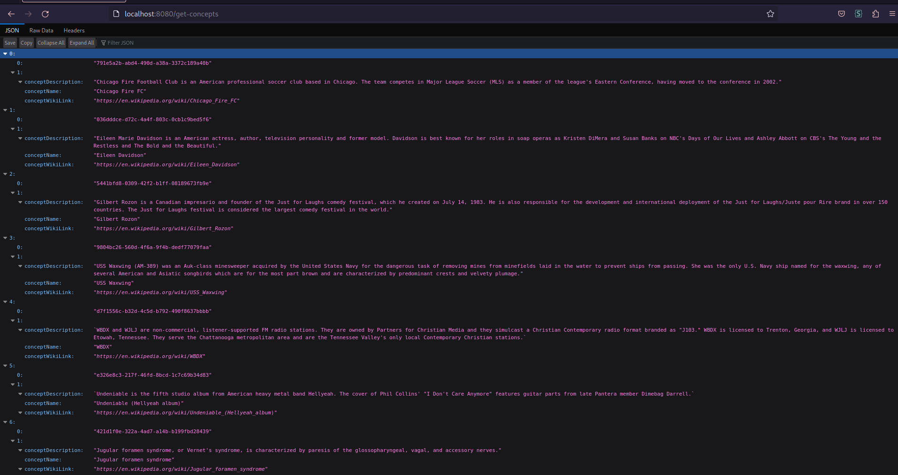
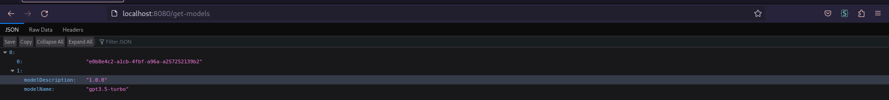
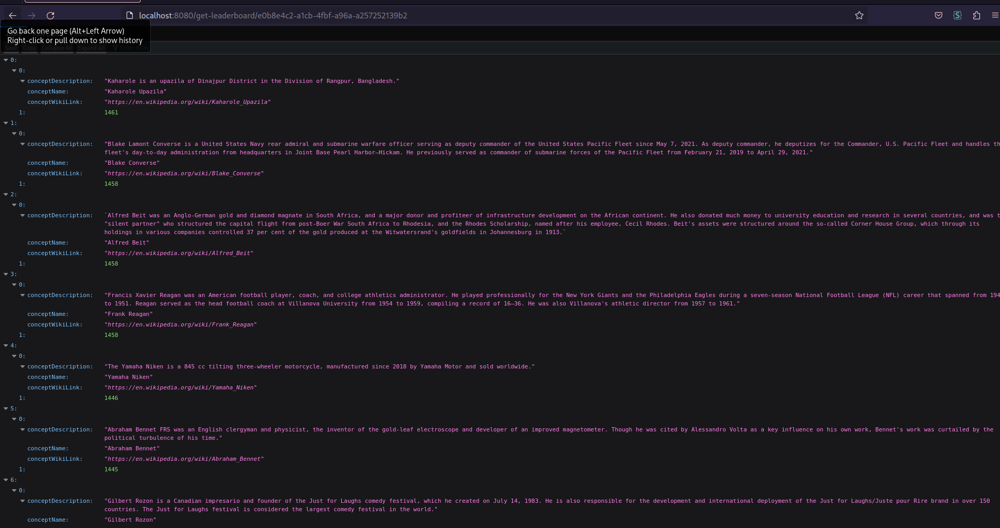

# WhichIsBetterAI - API Documentation

Welcome to WhichIsBetterAI's API documentation. This program, inspired by [ELO Everything](https://eloeverything.co/) created by [granawkins](http://twitter.com/granawkins), 

ELO Everything is a fun site where users compare two things and decide which is better. WhichIsBetterAI uses AI models to compare random concepts pulled from Wikipedia and then adjusts their ELO scores based on the outcomes. Inspired by this ranking concept, the goal of WhichIsBetterAI is to create a fully scalable system where various AI models can run identical ELO comparison matchups. This will result in diverse ELO leaderboards, which could serve as a powerful tool for detecting AI bias.

In the spirit of open collaboration and advancement in AI, I plan to fully release the comparison dataset for each model for further analysis. I hope this will provide valuable insights into how different AI models interpret and analyze information.


## Acknowledgments

This project was scaffolded using the [Servant Template](https://github.com/tweag/servant-template) as a starting point. I express  gratitude to the developers of this template for providing a great starting point for developing Haskell Servant applications.

## Main Features

- **Add new Concepts:** You can add new concepts from Wikipedia, including the name, description and the Wikipedia link.
- **Add new Models:** You can add new AI models for comparisons, including the model name and description.
- **Run Random Comparisons:** You can run random comparisons using AI models between different concepts.
- **Get ELO scores:** You can retrieve ELO scores for different concepts.
- **Get Leaderboard:** You can retrieve a leaderboard for different concepts based on their ELO scores.

## Data Model

The data model of this application revolves around four main entities: `Concepts`, `AI Models`, `Comparison Results`, and `ELO Scores`. Here's a detailed overview:

1. **Concepts:** These are the subjects of comparison. Each concept has a unique identifier (`concept_id`), a name (`concept_name`), a description (`concept_description`), and a link to its corresponding Wikipedia page (`concept_wiki_link`). 

2. **AI Models:** These are the models that perform the comparisons. Each model has a unique identifier (`model_id`), a name (`model_name`), and a description (`model_description`).

3. **Comparison Results:** This table holds the results of the comparisons performed by the AI models. Each comparison has a unique identifier (`comparison_id`), the IDs of the two compared concepts (`concept1_id` and `concept2_id`), the ELO scores of the concepts before and after the comparison (`concept1_elo_before`, `concept2_elo_before`, `concept1_elo_after`, `concept2_elo_after`), the ID of the winning concept (`winning_concept_id`), the ID of the model that performed the comparison (`model_id`), and the timestamp of the comparison (`comparison_timestamp`).

4. **ELO Scores:** This table holds the ELO scores of the concepts. Each entry has a unique identifier (`elo_id`), the ID of the concept (`concept_id`), the ID of the model that determined the score (`model_id`), the actual ELO score (`elo_score`), and the timestamp of the last update (`last_update_timestamp`).

In all tables, UUIDs are used for unique identifiers, while standard SQL data types are used for the other fields (VARCHAR for text, INTEGER for numbers, and TIMESTAMP WITH TIME ZONE for timestamps).

See schema.sql for more detail


## Endpoints

The API offers various endpoints for interacting with the data:

- `/get-elos`: Retrieves ELO scores.
- `/get-leaderboard`: Retrieves the leaderboard.
- `/add-model`: Adds a new AI model.
- `/get-models`: Retrieves all AI models.
- `/get-comparisons`: Retrieves all comparisons.
- `/run-random-comparisons`: Runs random comparisons.
- `/add-concept`: Adds a new concept.
- `/get-concepts`: Retrieves all concepts.

note there are several internal API endpoints that you can enable, soon I will document them all!

## Setting Up and Running the Server

To get the server up and running, follow these steps:

1. **Enter the Nix flake shell:** Run the following command to do this:

```bash
nix develop
```

2. **Set up the database:** You can do this by running the setup script. Here's the command:

```bash
bin/db/setup
```

3. **Build the API:** Run the build script with the following command:

```bash
bin/db/build
```

4. **Start the server:** Finally, you can start the server by running the serve script:

```bash
bin/db/serve
```

With these steps, you should be able to get your server up and running!

## Example Results

Here are some examples of the results you can get from this API.

### Get Concepts Endpoint

Here is an example of what you might get when you call the `getConcepts` endpoint:



### Get Models Endpoint

Here is an example of what you might get when you call the `getModels` endpoint:



### Get Leaderboard Endpoint

Here is an example of what you might get when you call the `getLeaderboard` endpoint:




## PopulateDB.hs - Automatic Population of Database

This Haskell script is designed to automatically fetch random articles from Wikipedia, extract relevant information, and add them as concepts in the database.

### Key Functions

- `fetchRandomArticle`: Fetches a random article summary from Wikipedia.
- `login`: Logs into the local server with a provided username and password.
- `addConcept`: Adds a new concept to the database using the given article information.

### How to Run the Script

To run the script, use `stack ghci PopulateDB.hs` from the command line in the directory where `PopulateDB.hs` is located. This starts an interactive GHC session with `PopulateDB.hs` loaded.

After the GHC session is started, simply run the `populateDB` function with the command `populateDB`.

This script will automatically fetch and add 2000 random Wikipedia articles as concepts in the database. You can change this number in the `populateDB` function.

## Tagger.AI.hs - Running Comparisons with OpenAI

This Haskell script is designed to run comparisons between two concepts using OpenAI's GPT-3.5-turbo model. 

### Key Functions

- `similarEnough`: This function uses Jaro-Winkler distance, a measure of similarity between two strings, to determine if two concepts are similar enough. It is mainly used in the `runComparison` function to decide which of the concepts was chosen by the model.
- `runComparison`: This is the main function of this script. It takes the names of two concepts and runs a comparison using OpenAI's GPT-3.5-turbo model. It returns the name of the concept that the model considers 'better'. 

## Note on User and Content Types

You might notice that I have retained the User and Content types from the original Servant template. These types were part of the original template's user authentication functionality.

I decided to keep them intact even though I'm not currently using these features in the `WhichIsBetterAI` program. I believe it's beneficial to keep this functionality for possible future enhancements. This will allow me to add user-specific features or content management capabilities more easily should I decide to include them in future updates.

Currently the easiest way to register a user is to launch the template frontend with `cd elm; npx elm-live src/Main.elm` and then registering on the UI. Once you register with a "test" "test" user you can use the populateDB script or a different script that utilizes the `login` endpoint

## Performance

I have yet to pass over the project for performance enhancements and I am sure that there are many processes that have been written sub-optimaly


## Frontend (Work in Progress)
I am currently developing a frontend for the application. The frontend will be a website built using Elm, and will provide a user-friendly interface to view the leaderboards for each model, see the results of every comparison, and much more!
Stay tuned for updates as I continue to develop and improve the application.
